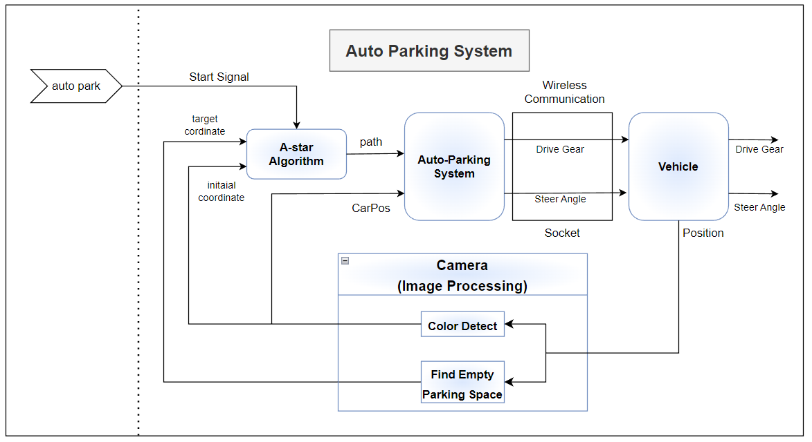
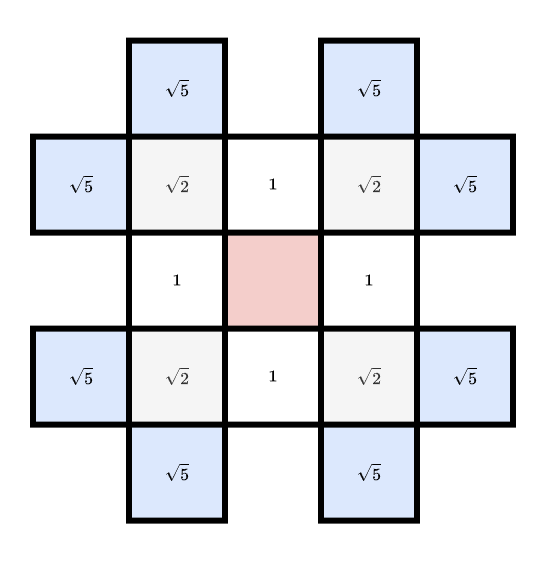
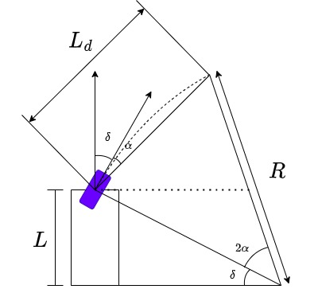
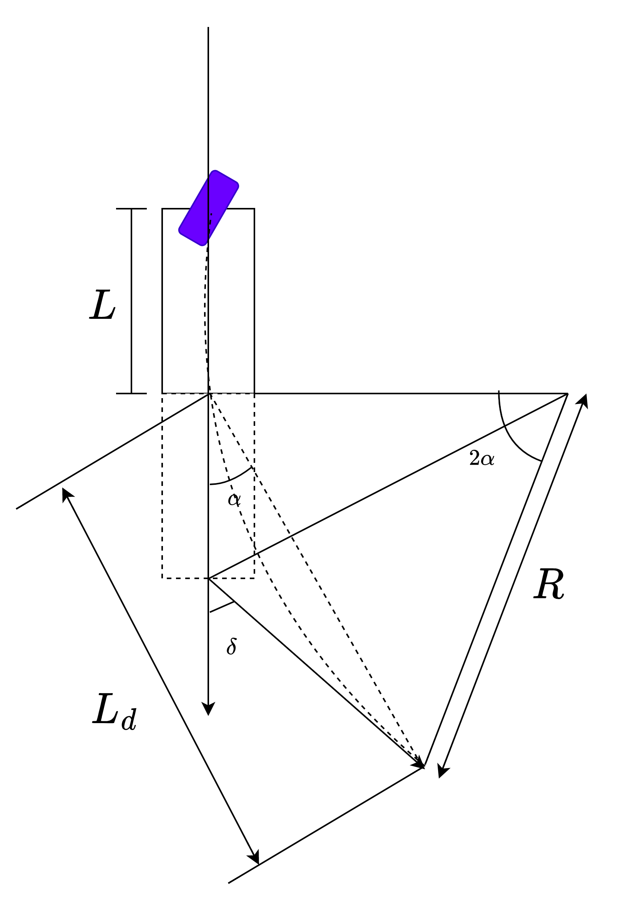

# 🚗 Centralized-Parking-System

Top-view 카메라 기반의 영상 처리 기술과 경로계획 알고리즘을 결합한 **실시간 자율 주차 시스템**입니다.  
C++와 Python을 활용하여 비정형 장애물을 회피하고 최적의 경로로 정밀 후방 주차를 수행합니다.

---

## 🌟 Key Features: Obstacle Avoidance

본 프로젝트의 핵심 역량인 **실시간 장애물 회피** 시연 영상입니다.

| 정적 장애물 회피 주차 (Static) | 동적 장애물 감지 및 제동 (Dynamic) |
|:---:|:---:|
| <video src="https://github.com/Junyoung-Gwak/Centralized_Parking_System/blob/main/assets/04_Static_Obstacle_Avoidance.mp4" width="380" controls></video> | <video src="https://github.com/Junyoung-Gwak/Centralized_Parking_System/blob/main/assets/05_Dynamic_Obstacle_Avoidance.mp4" width="380" controls></video> |
| **A* 알고리즘**을 통한 최적 주차 경로 생성 | 경로 내 장애물 침범 시 **즉각 제동 및 안전 확보** |

---

## 🏗️ System Configuration

중앙 서버(PC)가 모든 연산을 처리하고 RC카를 제어하는 **중앙 집중형 구조**입니다.

  

1. **Vision Node:** Top-view 영상을 분석하여 주차면 점유 상태 및 차량 마커 추적
2. **Planning Node:** 현재 위치에서 목표 주차 칸까지의 최적 궤적 생성
3. **Control Node:** TCP/IP 소켓을 통해 RC카에 조향 및 속도 명령 전송

---

## ⚙️ Core Algorithms

### 1. Custom A* Path Planning (Heuristic)
차량의 **실제 회전 반경과 주차 가능 각도**를 고려한 커스텀 휴리스틱 함수를 적용했습니다.

  

* *Weighting Strategy:* 목표 지점과의 거리 비용에 차량의 헤딩 방향(Heading) 페널티를 결합하여 후방 주차에 최적화된 경로를 산출합니다.

### 2. Pure Pursuit Control
전진과 후진 상황에 각각 최적화된 제어기를 구현하여 경로 추종 성능을 높였습니다.

| 전진 추종 (Forward) | 후방 주차 제어 (Backward) |
|:---:|:---:|
|  |  |
| Look-ahead 거리를 조절하여 조향 안정성 유지 | 후진 시 조향각 반전 및 정밀 제어 구현 |

---

## 🎬 Basic Parking Scenarios

기본 환경에서의 알고리즘 검증 결과입니다. (※ 재생이 안 될 경우 파일을 클릭해 주세요.)

| 전진 주차 | 후방 주차 (기본) | 후방 주차 (각도 심화) |
|:---:|:---:|:---:|
| <video src="https://github.com/Junyoung-Gwak/Centralized_Parking_System/blob/main/assets/01_Forward_Parking.mkv" width="250" controls></video> | <video src="https://github.com/Junyoung-Gwak/Centralized_Parking_System/blob/main/assets/02_Reverse_Parking_Basic.mkv" width="250" controls></video> | <video src="https://github.com/Junyoung-Gwak/Centralized_Parking_System/blob/main/assets/03_Reverse_Parking_Angle.mkv" width="250" controls></video> |

---

## 🛠 Tech Stack
- **Language:** C++, Python
- **Library:** OpenCV (Image Processing)
- **Protocol:** TCP/IP Socket Communication
- **Hardware:** RC Car, Raspberry Pi, Top-view Camera
